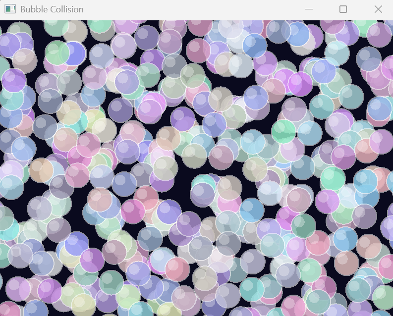
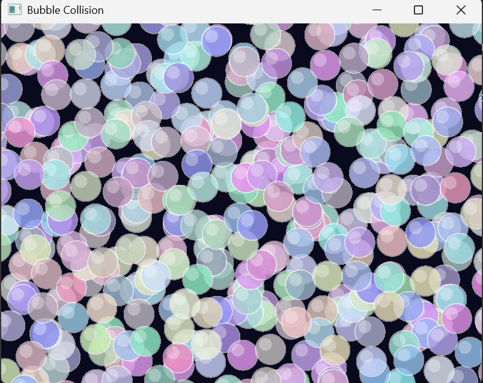

# 🫧 Collision Simulation : Brute Force vs Quadtree
**2D Collision Detection using C++ & SFML**

---

## Deskripsi Proyek
Proyek ini merupakan simulasi collision detection dua dimensi menggunakan bahasa pemrograman C++ dan library grafis SFML. Simulasi memodelkan partikel berbentuk bubble yang bergerak secara dinamis di dalam sebuah area tertutup, saling bertabrakan satu sama lain, serta memantul ketika mengenai batas dinding. Fokus utama proyek ini adalah perbandingan dua algoritma collision detection, yaitu Brute Force dan Quadtree, yang dapat di-switch secara real-time untuk mengamati perbedaan performa dan kompleksitasnya secara langsung.

---

## Tujuan Proyek
- Mengimplementasikan sistem collision detection 2D
- Membandingkan kompleksitas waktu dan performa Brute Force vs Quadtree
- Menerapkan konsep dasar fisika (gerak partikel dan elastic collision)
- Memvisualisasikan konsep spatial partitioning
- Mengembangkan simulasi yang stabil, interaktif, dan responsif

---

## Tools & Teknologi
- Bahasa : C++  
- Library : SFML 3.0.2  
- Compiler : MinGW-w64 (GCC)  
- Version Control : Git  
- Editor : Visual Studio Code
- Platform : Windows  

---

## Referensi
- Reducible – Building Collision Simulations: An Introduction to Computer Graphics
- Okapidev – Making a Physics Simulation in C++!

---

## Dasar Fisika & Persamaan
Gerak partikel dihitung menggunakan persamaan :
```text
x(t + Δt) = x(t) + v · Δt
```

Deteksi tabrakan antar partikel :
```text
|x1 - x2| ≤ r1 + r2
```

Elastic collision (massa sama):
```text
v1' = v1 - ((v1 - v2) · n) n  
v2' = v2 - ((v2 - v1) · n) n  
```

Pantulan dinding :
```text
vx = -vx (dinding vertikal)  
vy = -vy (dinding horizontal)  
```
---

## Algoritma Collision Detection
**Brute Force**
Brute Force melakukan pengecekan tabrakan dengan membandingkan setiap pasangan partikel :
```text
for i = 0 to n-1  
for j = i+1 to n-1  
cek tabrakan (i, j)
```

Kompleksitas waktu : O(n²)  
Kelebihan : sederhana dan mudah diimplementasikan  
Kekurangan : performa menurun drastis saat jumlah partikel besar  

**Quadtree**
Quadtree menggunakan spatial partitioning dengan membagi ruang menjadi empat kuadran secara rekursif. Partikel hanya dicek dengan partikel lain di node yang sama atau berdekatan.  
Kompleksitas waktu rata-rata : O(n log n)  
Keunggulan : jauh lebih efisien untuk jumlah partikel besar  

---

## Alur Simulasi Program
Inisialisasi window dan partikel → Update posisi partikel (fixed timestep) → Deteksi collision (Brute Force / Quadtree) → Resolusi tabrakan → Render ke layar → Input user (switch algoritma)

---

## ⌨Switching Algoritma (Real-Time)
Tekan tombol SPACE untuk mengganti mode collision detection:
Brute Force ↔ Quadtree  
Fitur ini memungkinkan perbandingan performa secara langsung tanpa menghentikan simulasi.

---

## Fitur & Kreativitas
Bubble besar berwarna cerah, fixed timestep physics untuk stabilitas simulasi, sistem anti-stuck agar partikel tidak diam di pojok, boundary constraint agar partikel tidak keluar area, toggle algoritma real-time, dan visual yang clean serta responsif.

---

## Struktur Folder
```text
collision-simulations/
├── src/
│   ├── main.cpp
│   ├── Particle.cpp
│   ├── Particle.h
│   ├── Quadtree.cpp
│   └── Quadtree.h
├── assets/
│   ├── bruteforce.png
│   ├── quadtree.png
│   └── record.mp4
└── README.md 
```
---

## Cara Build & Run
Pastikan SFML berada pada direktori C:\SFML  

Compile :
g++ src/main.cpp src/Particle.cpp src/Quadtree.cpp -I"C:/SFML/include" -L"C:/SFML/lib" -lsfml-graphics -lsfml-window -lsfml-system -o collision.exe  

Run :
./collision.exe  

---

## Kontrol Program
SPACE : Switch Brute Force / Quadtree  
Close Window : Keluar Program  

---

## Hasil & Analisis
Brute Force menunjukkan penurunan performa signifikan ketika jumlah partikel meningkat, sedangkan Quadtree memberikan performa yang lebih stabil dan efisien dengan mengurangi jumlah pengecekan tabrakan. Visualisasi simulasi membantu memahami perbedaan pendekatan algoritma secara intuitif.

---

## Dokumentasi Visual
**Brute Force**


**Quadtree**


**Screen Record**
[Klik untuk melihat screen record](assets/record.mp4)